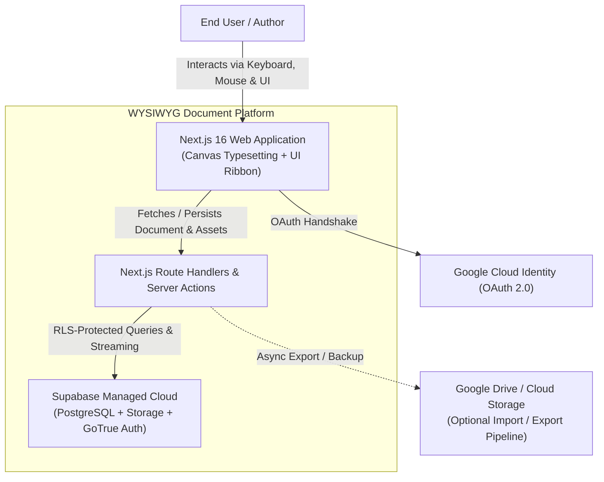
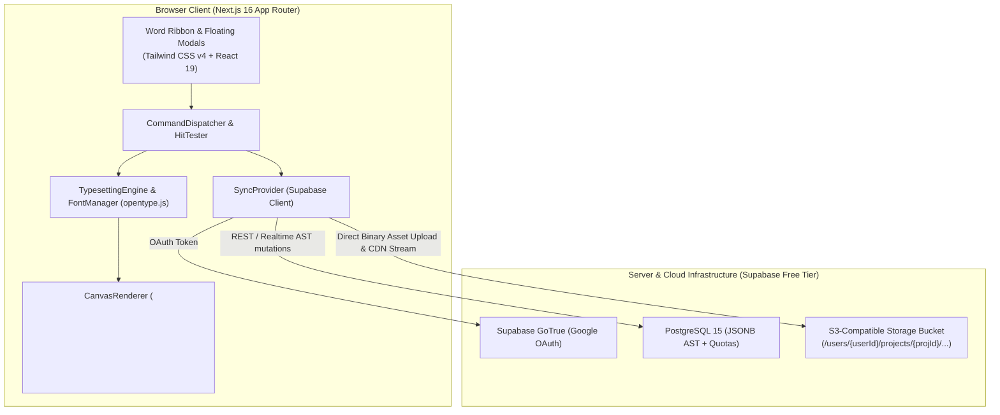
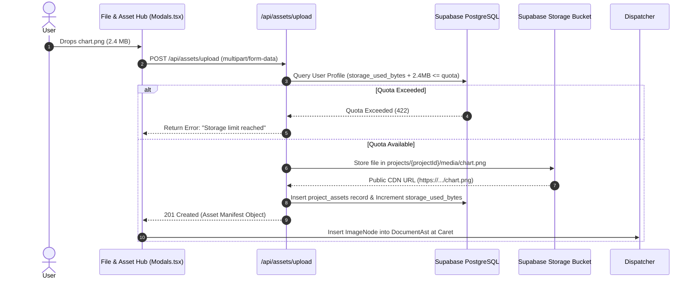

# WYSIWYG Document Editor - Architecture Specification

## 1. System Overview & Problem Statement
Modern web-based word processors suffer from three core systemic failures:
1. **Non-deterministic DOM Reflow**: Browser HTML/CSS text rendering varies across operating systems, browser engines, zoom factors, and default font rasterizers. This breaks WYSIWYG fidelity, making true print/DOCX page-boundary reproduction impossible in standard HTML.
2. **Global Media Pollution & Weak Isolation**: Traditional web apps store uploaded media globally without document scoping, causing dangling references, security leaks across confidential documents, and complex export packaging.
3. **High-Latency Cloud Document Sync**: Relying directly on external third-party file APIs (e.g. Google Drive REST) creates unacceptable latency (300–800ms per write), strict rate-limit throttling, and cross-origin security barriers for canvas rendering.

### System Solution
This editor implements a **deterministic `<canvas>` rendering pipeline** coupled with a **Project-Scoped Cloud Architecture**:
- **Canvas-Only Visual Layer**: Strictly avoids native browser DOM text reflow. Layout, line-breaking, hyphenation, margins, and pagination boundaries are mathematically calculated and painted directly to HTML5 Canvas 2D.
- **OPC-Compliant Project Workspace Model**: Documents and their assets (PNG, JPG, SVG, Markdown, PDF, CSV) are packaged in an isolated project bundle modeled 1:1 on the Open Packaging Conventions (OPC) of OpenXML `.docx`.
- **Hybrid High-Speed Cloud Persistence**: Uses Supabase (PostgreSQL + S3-compatible Object Storage + Auth) for sub-50ms AST persistence and direct CDN binary streaming, while maintaining standard Google OAuth identity and optional external cloud drive export pipelines.

---

## 2. High-Level Architecture & Mermaid C4 Diagrams

### 2.1 C4 Context Diagram (System Context)



### 2.2 C4 Container Diagram (Client & Cloud Service Topology)



---

## 3. State Management & Data Flow Architecture

### 3.1 Unidirectional Canvas Interaction Loop
The visual canvas acts as a pure downstream projection of an immutable `DocumentAst`:

```mermaid
sequenceDiagram
    autonumber
    actor User
    participant DOM as Hidden <textarea> & Pointer Capture
    participant Dispatcher as CommandDispatcher
    participant Mutator as DocumentMutator
    participant State as Document State (AST)
    participant Typesetter as TypesettingEngine
    participant Renderer as CanvasRenderer (<canvas>)
    participant Cloud as Cloud Sync (Supabase)

    User->>DOM: Keystroke (e.g. 'Hello') / Click
    DOM->>Dispatcher: Raw Input / Normalized (X, Y) Coordinates
    Dispatcher->>Mutator: Dispatch Action (e.g. INSERT_TEXT)
    Mutator->>State: Produce New Immutable DocumentAst
    State-->>Typesetter: Notify Dirtied Sections
    Typesetter->>Typesetter: Recalculate Word Wrapping & Pagination
    Typesetter->>Renderer: Generate RenderTree (PageBox, LineBox, GlyphRun)
    Renderer->>Renderer: ctx.clearRect() & Batch Paint
    State-->>Cloud: Debounced Background Autosave (sub-50ms)
```



### 3.2 Cloud Persistence & Project-Scoped Asset Data Flow
Each document is an isolated container. Assets uploaded to a project never leak into other documents:



---

## 4. Data Models, Types & Schemas

### 4.1 Strict Zod Schemas (Persistence & Transport Layer)

```typescript
import { z } from 'zod';

// ============================================================================
// 1. AUTHENTICATED USER PROFILE & STORAGE QUOTA
// ============================================================================
export const UserProfileSchema = z.object({
  id: z.string().uuid(),
  email: z.string().email(),
  fullName: z.string().nullable(),
  avatarUrl: z.string().url().nullable(),
  storageQuotaBytes: z.number().int().nonnegative().default(262144000), // 250 MB default
  storageUsedBytes: z.number().int().nonnegative().default(0),
  createdAt: z.string().datetime(),
});
export type UserProfile = z.infer<typeof UserProfileSchema>;

// ============================================================================
// 2. PROJECT CONTAINER (The Document Workspace Bundle)
// ============================================================================
export const ProjectSchema = z.object({
  id: z.string().uuid(),
  ownerId: z.string().uuid(),
  title: z.string().min(1).max(255).default('Untitled Document'),
  documentAst: z.record(z.any()), // Validated against DocumentAstSchema
  createdAt: z.string().datetime(),
  updatedAt: z.string().datetime(),
});
export type Project = z.infer<typeof ProjectSchema>;

// ============================================================================
// 3. PROJECT-SCOPED ASSET MANIFEST
// ============================================================================
export const ProjectAssetSchema = z.object({
  id: z.string().uuid(),
  projectId: z.string().uuid(),
  ownerId: z.string().uuid(),
  name: z.string().min(1).max(255),
  fileType: z.enum(['png', 'jpg', 'jpeg', 'svg', 'pdf', 'csv', 'docx', 'md']),
  sizeBytes: z.number().int().positive(),
  storagePath: z.string(),
  publicUrl: z.string().url(),
  role: z.enum(['inline-embed', 'table-source', 'reference-attachment']),
  createdAt: z.string().datetime(),
});
export type ProjectAsset = z.infer<typeof ProjectAssetSchema>;

// ============================================================================
// 4. DOCUMENT AST EXTENSIONS (Images & Visual Nodes)
// ============================================================================
export const ImageNodeSchema = z.object({
  id: z.string(),
  type: z.literal('image'),
  assetId: z.string().uuid(),
  src: z.string().url(),
  alt: z.string().default(''),
  width: z.number().positive(),
  height: z.number().positive(),
  alignment: z.enum(['left', 'center', 'right']).default('center'),
  wrapMode: z.enum(['inline', 'break', 'tight']).default('break'),
});
export type ImageNode = z.infer<typeof ImageNodeSchema>;
```

---

## 5. Trade-off Matrix

| Vector / Component | Option Considered | Pros | Cons | Decision Rationale & Rejected Alternatives |
| :--- | :--- | :--- | :--- | :--- |
| **Auth Provider** | **Supabase Auth (Google OAuth)** vs. NextAuth / Custom JWT | Instant integration with PostgreSQL RLS; 50k MAU free; zero server maintenance. | Tied to Supabase ecosystem. | **Selected Supabase Auth**. Rejected custom JWT/NextAuth because Supabase GoTrue maps directly to PostgreSQL RLS policies without extra middleware glue. |
| **Storage Provider** | **Supabase S3 Bucket** vs. Direct User Google Drive | Sub-10ms latency; native CDN; direct `<canvas>` binary streaming; zero OAuth consent warnings. | 1GB free tier limit per Supabase project. | **Selected Supabase S3**. Rejected Direct Google Drive storage due to severe write rate-limiting (300-800ms) and CORS canvas taint security blocks. |
| **Asset Scoping** | **Project-Scoped Assets** vs. Global User Assets | 1:1 mapping with OpenXML `word/media/`; zero cross-document corruption; clean atomic export. | Requires tracking asset-to-project relationships. | **Selected Project-Scoped**. Rejected Global assets because deleting an asset in one document could break another document's layout. |
| **Document State Sync** | **Debounced REST AST Push** vs. Real-time WebSocket CRDT | Simple, lightweight, zero operational complexity on free-tier PostgreSQL. | Does not support simultaneous 2-person character-level typing out of the box. | **Selected Debounced REST AST Push** for Phase 1. Designed with migration path to Yjs/Supabase Realtime for Phase 2 multiplayer. |

---

## 6. API Contracts & Endpoint Specifications

All endpoints adhere to standardized JSON envelopes:

### 6.1 Authentication Handshake
- **Route**: `GET /auth/callback`
- **Purpose**: Exchanges Google OAuth code for Supabase JWT session, provisions user profile with 250MB quota via PostgreSQL trigger, and redirects to editor.

### 6.2 Project Workspace CRUD
- `GET /api/projects`: List user's active document projects.
- `POST /api/projects`: Create a new project bundle with initial blank `DocumentAst`.
- `GET /api/projects/:id`: Fetch complete project bundle (AST + scoped asset manifest).
- `PUT /api/projects/:id`: Autosave updated `DocumentAst` (debounced).
  ```json
  // Request Payload
  {
    "title": "Quarterly Financial Analysis",
    "documentAst": { ... }
  }
  // Response Envelope
  {
    "success": true,
    "data": { "id": "...", "updatedAt": "2026-09-30T09:45:00Z" }
  }
  ```

### 6.3 Asset Upload & Quota Management
- `POST /api/projects/:id/assets`
  - **Content-Type**: `multipart/form-data`
  - **Body**: `file: Blob`, `role: 'inline-embed' | 'table-source' | 'reference-attachment'`
  - **Validation**: Enforces user quota (`used + size <= quota`).
  - **Success (201)**:
    ```json
    {
      "success": true,
      "data": {
        "id": "asset-uuid",
        "name": "revenue_chart.png",
        "publicUrl": "https://.../media/revenue_chart.png",
        "sizeBytes": 2450000,
        "storageQuota": {
          "usedBytes": 12450000,
          "quotaBytes": 262144000
        }
      }
    }
    ```
  - **Error (422)**:
    ```json
    {
      "success": false,
      "error": {
        "code": "QUOTA_EXCEEDED",
        "message": "Storage quota of 250MB exceeded. Please remove unused assets."
      }
    }
    ```

---

## 7. Security, Non-Functional Requirements & Performance Budgets

1. **Security & Row Level Security (RLS)**:
   - Database tables (`projects`, `project_assets`, `profiles`) have RLS enabled with `auth.uid() = owner_id`. No user can query or modify another user's document or assets.
   - Storage buckets enforce path policies: only the authenticated user matching `/users/{userId}/...` can write objects.
2. **XSS & Canvas Binary Protection**:
   - Canvas rasterization renders only parsed glyphs and verified image blobs. No `dangerouslySetInnerHTML` or unparsed SVG XML injection is permitted in the document body.
3. **Performance Budgets**:
   - **Typesetting latency**: $\le 16\text{ms}$ per incremental keystroke mutation.
   - **Autosave payload**: Compressed AST JSON $\le 500\text{KB}$ per request.
   - **Asset loading**: Images streamed over CDN with `crossOrigin="anonymous"` to preserve canvas security context.

---

## 8. Migration & Extension Roadmap
- **Phase 1 (Current)**: Supabase Auth (Google OAuth) + PostgreSQL AST Storage + Scoped S3 Assets + Quota Manager.
- **Phase 2**: Yjs CRDT real-time sync over Supabase Realtime Channels for multi-cursor collaborative editing.
- **Phase 3**: Bidirectional Google Drive Sync (exporting native `.docx` directly to the user's Drive on demand).
